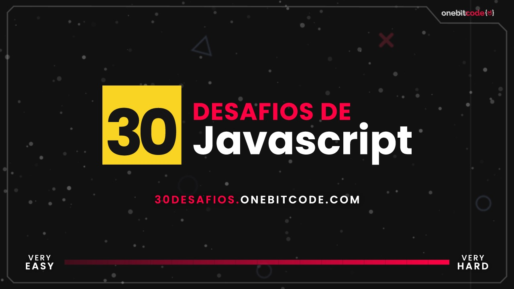

# 30 DESAFIOS DE JAVASCRIPT  | 

##  🚀 Sobre o Desafio  🚀
***

São 30 desafios do básico ao mais avançado para exercitar minha lógica de programação e aprender a enfrentar diversos cenários e aumentar meu repertorio de soluções. Ao longo destes desafios irei enfrentar questões de strings, arrays, estruturas básicas, classes, datas, manipulações de tipos, objetos, arquivos e muito mais. Este é um projeto desenvolvido pela Onebitcode.

  

  

###  Processo de aprendizagem ⌨️🖱

Ao final de cada módulo, irei  fazer um breve resumo das dificuldades enfrentadas e soluções encontradas

### Very easy
***
### Easy
***
### Medium
***
### Hard
***
### Very hard
***

## Considerações finais